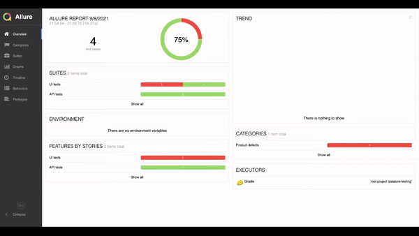
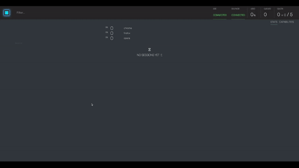

## Web Automation with Selenium and REST-Assured for Petstore app

### Technology Stack

- Selenium WebDriver
- Rest Assured
- Java
- Junit5
- Allure Report
- Gradle
- Selenoid

### Run tests
Run tests from IDE or `./gradlew clean test` in command line - tests will be executed in local Chrome browser

If need to overwrite default properties: copy-paste and change properties from `resources/properties/*.properties.example` files to `resources/properties/*.properties` files

Run on selenoid: `./gradlew testSelenoid` or `./gradlew test -Ddriver=selenoid`or run tests with `testSelenoid` task in IDE. 
By default `selenoid.url=http://localhost:4444/wd/hub/` the property value can be changed in `selenoid.properties`

In order to change Base URL overwrite `base.url` property in `application.properties` or set system property in command line, for example:

`./gradlew test -Dbase.url=https://petstore.swagger.io`

`./gradlew testSelenoid -Dbase.url=https://petstore.swagger.io`

Default value is: `https://petstore.swagger.io`

### Generate Allure report
`./gradlew allureReport` - report will be located in `build/reports/allure-report/index.html`

### Allure report

### Selenoid

